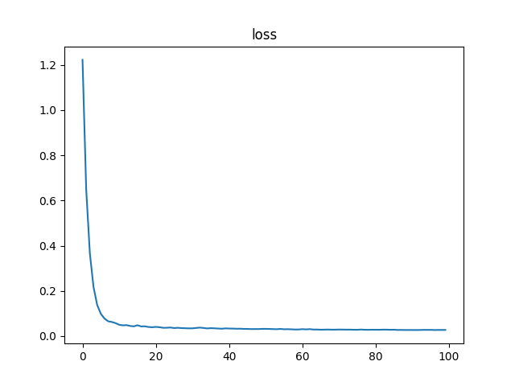

# Leaves Segmentation Challenge

<p align="center">
    <br>
</p>

## Table of Contents

- [Introduction](#introduction)
- [Prerequisites](#prerequisites)
- [Usage](#usage)
- [Results](#results)
  - [Loss](#loss)
  - [Prediction](#prediction)
  - [Ground Truth](#ground-truth)
- [License](#license)

## Introduction

The **Leaves Segmentation Challenge** addresses the task of segmenting leaves from images, a fundamental step in plant phenotyping and agricultural research. Accurate segmentation of leaves from images enables automated analysis of plant growth, health, and development.

In this challenge, we employ a U-Net architecture, a popular convolutional neural network (CNN) model known for its effectiveness in image segmentation tasks. The U-Net architecture consists of a contracting path to capture context and a symmetric expanding path for precise localization.

To prepare the dataset for training, we convert the label annotations into grayscale images, facilitating the segmentation process. During training, we utilize the AdamW optimizer and a cosine annealing learning rate scheduler. The choice of these optimization techniques helps in efficiently navigating the parameter space and converging to a desirable solution.

For loss computation, we employ the L1 loss function, which calculates the mean absolute error between predicted and ground truth pixel values. This loss function is suitable for segmentation tasks as it penalizes deviations regardless of direction, ensuring robust training.

The training process spans over 15 epochs, during which the model learns to accurately segment leaves from images. Upon completion of training, the final achieved loss is 0.0309, indicative of the model's ability to minimize segmentation errors and generalize well to unseen data.

In the subsequent sections, we present the results of the trained model, showcasing the loss curve, predicted segmentations, and ground truth annotations. These visualizations offer insights into the performance and efficacy of the developed segmentation pipeline.

## Prerequisites

- Docker
- Nvidia Docker runtime (if you want to use GPU)

## Usage

1. Clone the repository:

```bash
git clone https://github.com/hibana2077/Leaves-Segmentation-Challenge.git
```

2. Download the dataset:

```bash
cd Leaves-Segmentation-Challenge
mkdir data
```

[Download the dataset](https://drive.google.com/file/d/1d-v1maWOpt0U4pY7NrMo2K3z7Xm_2xRv/view?usp=sharing) and put the downloaded file in the `data` directory, also unzip the file.

3. Create a docker container with the following command:

```bash
docker run -it --rm --runtime=nvidia -v $(pwd):/app -w /app pytorch/pytorch:2.2.0-cuda12.1-cudnn8-runtime
```

4. Install the required packages:

```bash
apt update && apt install -y vim
pip3 install -r requirements.txt
```

5. Run the training script:

```bash
cd src
python3 main.py
```

## Results

### Loss



### Prediction


### Ground Truth


## License

