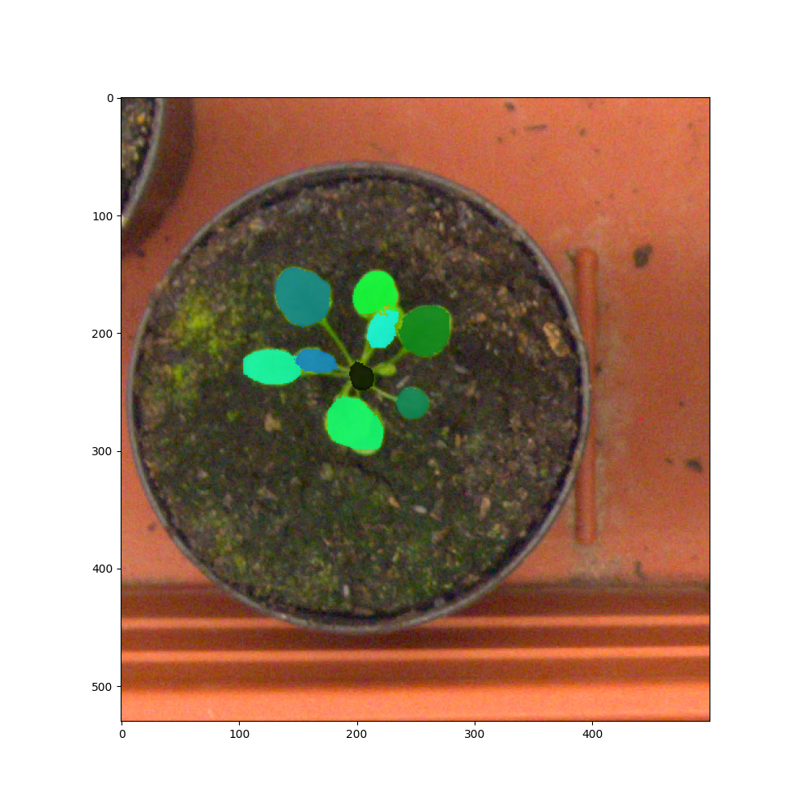
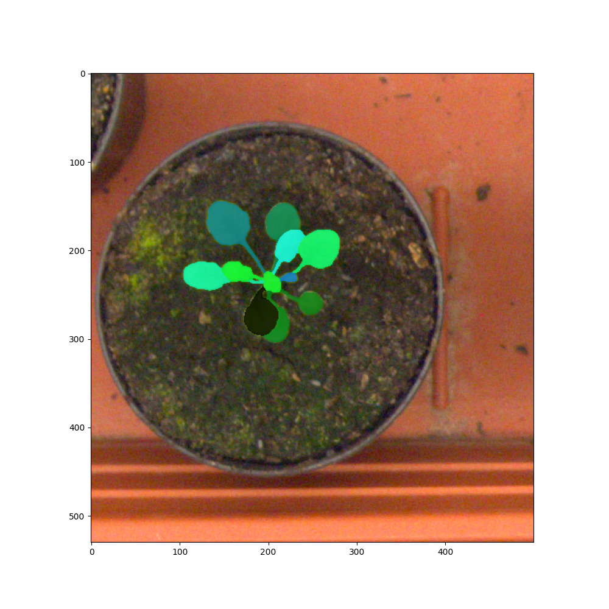

<!--
 * @Author: hibana2077 hibana2077@gmail.com
 * @Date: 2024-05-03 14:04:51
 * @LastEditors: hibana2077 hibana2077@gmail.com
 * @LastEditTime: 2024-05-25 17:43:29
 * @FilePath: \Leaves-Segmentation-Challenge\README.md
 * @Description: 这是默认设置,请设置`customMade`, 打开koroFileHeader查看配置 进行设置: https://github.com/OBKoro1/koro1FileHeader/wiki/%E9%85%8D%E7%BD%AE
-->
# Leaves Segmentation Challenge

<p align="center">
    <br>
</p>

## Table of Contents

- [Introduction](#introduction)
- [Prerequisites](#prerequisites)
- [Usage](#usage)
- [Results](#results)
  - [Loss](#loss)
  - [Prediction](#prediction)
  - [Ground Truth](#ground-truth)
- [License](#license)

## Introduction

This repository encompasses two distinct types of models designed for the leaf segmentation challenge:

- Semantic Segmentation
- Instance Segmentation

### Semantic Segmentation

For the semantic segmentation task, we implemented the U-Net model, which is renowned for its effectiveness in medical image segmentation. The model's architecture facilitates precise segmentation by using a contracting path to capture context and a symmetric expanding path for localization. To optimize the performance, we employed the L1 loss function, which is particularly suitable for regression tasks as it is less sensitive to outliers. The AdamW optimizer was chosen due to its adaptive learning rate capabilities and decoupled weight decay, which aids in faster convergence. Furthermore, we adopted a cosine annealing learning rate adjustment strategy to dynamically adjust the learning rate during training, thus enhancing the model's ability to converge to a global minimum. This comprehensive approach resulted in a rapid decrease in loss, with the model achieving optimal performance after a total of 10 epochs.

### Instance Segmentation

In addressing the instance segmentation task, we leveraged the Mask R-CNN model, an extension of the Faster R-CNN model, designed to provide pixel-level segmentation of objects in an image. This model is equipped with a backbone network, which in our case, after thorough experimentation, was determined to be ResNet50. The selection of ResNet50 was based on its balance between performance and computational efficiency. Additionally, we utilized pre-trained weights from the COCO dataset, which provided a solid foundation for our model, enabling it to achieve faster convergence and improved accuracy. For optimization, we opted for Stochastic Gradient Descent (SGD), known for its robustness and efficiency in training deep learning models. Our training regimen, encompassing a total of 10 epochs, resulted in a significant reduction in loss and optimal model performance.

Both models demonstrated excellent results in their respective tasks, with rapid convergence and effective loss reduction, underscoring the efficacy of our chosen methodologies and hyperparameters. This repository serves as a comprehensive guide for implementing and optimizing both semantic and instance segmentation models for the leaf segmentation challenge.

## Prerequisites

- Docker
- Nvidia Docker runtime (if you want to use GPU)

## Usage

1. Clone the repository:

```bash
git clone https://github.com/hibana2077/Leaves-Segmentation-Challenge.git
```

2. Download the dataset:

```bash
cd Leaves-Segmentation-Challenge
mkdir data
```

[Download the dataset](https://drive.google.com/file/d/1d-v1maWOpt0U4pY7NrMo2K3z7Xm_2xRv/view?usp=sharing) and put the downloaded file in the `data` directory, also unzip the file.

3. Create a docker container with the following command:

```bash
docker run -it --rm --runtime=nvidia -v $(pwd):/app -w /app pytorch/pytorch:2.2.0-cuda12.1-cudnn8-runtime
```

4. Install the required packages:

```bash
apt update && apt install -y vim
pip3 install -r requirements.txt
```

5. Run the training script:

```bash
cd src
python3 main.py
```

## Results

### Loss


### Prediction



### Ground Truth



## License

